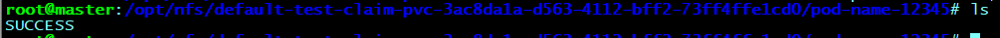

# kubenetes 基于NFS的动态存储卷(StorageClass)
> 参考文档:https://www.cnblogs.com/panwenbin-logs/p/12196286.html <br>
> 本文只做操作步骤备份，原理参考官方文档即可

前提:kubenetes集群已经安装好

### 1.安装NFS-Server(所有节点必须安装,如果已经装过可以跳过这步)
> 参考:https://www.aikiki.top/hexo/2020/03/17/Debian-10-%E6%90%AD%E5%BB%BA-nfs-%E6%9C%8D%E5%8A%A1%E5%99%A8/

注意: master节点安装NFS-Server,其他全部Node节点务必安装NFS-Common(客户端)，否则storageClass将创建失败！

#### master物理机安装nfs-server
```bash
$ apt-get install nfs-kernel-server                                                           # 安装
$ mkdir -p /data/nfs                                                                          # 创建共享目录
$ echo "/data/nfs  *(rw,no_subtree_check,root_squash,no_all_squash,insecure)" >> /etc/exports # 设置共享权限
$ source /etc/exports                                                                         # 检查配置(可能会报一些奇怪的错,可以考虑忽略)
$ /etc/init.d/nfs-kernel-server restart                                                       # 重启
```

#### node物理机安装nfs-common
```bash
$ apt-get install nfs-common                                # 安装
$ mkdir -p /data/nfs                                        # 创建共享目录
$ mount -n -o nolock 10.94.22.240:/data/nfs/ /data/nfs/     # 挂载(注:可以设置你自己的MasterIP和共享路径)
$ df -h                                                     # 查看是否挂载成功
Filesystem                       Size  Used Avail Use% Mounted on
10.94.22.240:/opt/nfs/logs-e...  111G   20G   86G  19% /var/lib/kubelet/...
$ cd /data/nfs/ && touch test.txt                           # 创建文件测试是否共享成功，此时回到master节点执行ls /data/nfs/应该能看到test.txt
```

### 2.创建rbac
> wget https://raw.githubusercontent.com/Joker1222/Personal-k8s-cfg/main/k8s_nfs_sc_pvc/rbac.yaml
```yaml
apiVersion: v1
kind: ServiceAccount
metadata:
  name: nfs-client-provisioner
  # replace with namespace where provisioner is deployed
  namespace: default #根据实际环境设定namespace,下面类同 ps:建议default
---
kind: ClusterRole
apiVersion: rbac.authorization.k8s.io/v1
metadata:
  name: nfs-client-provisioner-runner
rules:
  - apiGroups: [""]
    resources: ["persistentvolumes"]
    verbs: ["get", "list", "watch", "create", "delete"]
  - apiGroups: [""]
    resources: ["persistentvolumeclaims"]
    verbs: ["get", "list", "watch", "update"]
  - apiGroups: ["storage.k8s.io"]
    resources: ["storageclasses"]
    verbs: ["get", "list", "watch"]
  - apiGroups: [""]
    resources: ["events"]
    verbs: ["create", "update", "patch"]
---
kind: ClusterRoleBinding
apiVersion: rbac.authorization.k8s.io/v1
metadata:
  name: run-nfs-client-provisioner
subjects:
  - kind: ServiceAccount
    name: nfs-client-provisioner
    # replace with namespace where provisioner is deployed
    namespace: default
roleRef:
  kind: ClusterRole
  name: nfs-client-provisioner-runner
  apiGroup: rbac.authorization.k8s.io
---
kind: Role
apiVersion: rbac.authorization.k8s.io/v1
metadata:
  name: leader-locking-nfs-client-provisioner
    # replace with namespace where provisioner is deployed
  namespace: default 
rules:
  - apiGroups: [""]
    resources: ["endpoints"]
    verbs: ["get", "list", "watch", "create", "update", "patch"]
---
kind: RoleBinding
apiVersion: rbac.authorization.k8s.io/v1
metadata:
  name: leader-locking-nfs-client-provisioner
subjects:
  - kind: ServiceAccount
    name: nfs-client-provisioner
    # replace with namespace where provisioner is deployed
    namespace: default 
roleRef:
  kind: Role
  name: leader-locking-nfs-client-provisioner
  apiGroup: rbac.authorization.k8s.io

```
```bash
$ kubectl apply -f rbac.yaml
```

### 3.创建StorageClass
> wget https://raw.githubusercontent.com/Joker1222/Personal-k8s-cfg/main/k8s_nfs_sc_pvc/nfs-sc.yaml 
```yaml
apiVersion: storage.k8s.io/v1
kind: StorageClass
metadata:
  name: managed-nfs-storage
provisioner: robot-nfs-storage #这里的名称要和provisioner配置文件中的环境变量PROVISIONER_NAME保持一致
parameters:  
  archiveOnDelete: "true"
  reclaimPolicy: Retain #保证pod、pvc、pv被删除后数据不会丢失
```
```bash
$ kubectl apply -f nfs-sc.yaml
```

### 4.创建nfs-client-provisioner(Deployment)
> wget https://raw.githubusercontent.com/Joker1222/Personal-k8s-cfg/main/k8s_nfs_sc_pvc/nfs-pv.yaml
```yaml
apiVersion: v1
kind: ServiceAccount
metadata:
  name: nfs-client-provisioner
---
apiVersion: apps/v1
kind: Deployment
metadata:
  name: nfs-client-provisioner
  labels:
    app: nfs-client-provisioner
  # replace with namespace where provisioner is deployed
  #与RBAC文件中的namespace保持一致 “ps:建议default,我尝试换成其他的命名空间但是失败了”
  namespace: default 
spec:
  replicas: 1
  selector:
    matchLabels:
      app: nfs-client-provisioner
  strategy:
    type: Recreate
  selector:
    matchLabels:
      app: nfs-client-provisioner
  template:
    metadata:
      labels:
        app: nfs-client-provisioner
    spec:
      serviceAccountName: nfs-client-provisioner
      containers:
        - name: nfs-client-provisioner
          image: quay.io/external_storage/nfs-client-provisioner:latest
          volumeMounts:
            - name: nfs-client-root
              mountPath: /persistentvolumes
          env:
            - name: PROVISIONER_NAME
              value: robot-nfs-storage  #provisioner名称,请确保该名称与 nfs-sc.yaml文件中的provisioner名称保持一致
            - name: NFS_SERVER
              value: 10.94.22.240   #NFS Server IP地址 server master节点的地址 换成你的主节点IP即可
            - name: NFS_PATH   
              value: /opt/nfs    #NFS挂载卷 server路径 换成你的服务器路径即可
      volumes:
        - name: nfs-client-root
          nfs:
            server: 10.94.22.240  #NFS Server IP地址
            path: /opt/nfs #NFS 挂载卷 client路径 (pod) 换成你的client路径即可
```
```bash
$ kubectl apply -f nfs-pv.yaml
```

### 5.创建PVC
> wget https://raw.githubusercontent.com/Joker1222/Personal-k8s-cfg/main/k8s_nfs_sc_pvc/test-claim.yaml 
```yaml
kind: PersistentVolumeClaim
apiVersion: v1
metadata:
  name: test-claim    # 只创建一个PVC即可，该PVC与sc-pv绑定
  annotations:
    volume.beta.kubernetes.io/storage-class: "managed-nfs-storage"   #与nfs-StorageClass.yaml metadata.name保持一致
spec:
  accessModes:
    - ReadWriteMany
  resources:
    requests:
      storage: 1Mi      #所有pod公用这一个pvc即可，生产环境这里可以设置大一点
```
```bash
$ kubectl apply -f test-claim.yaml
```

### 6.创建Pod测试
> wget https://raw.githubusercontent.com/Joker1222/Personal-k8s-cfg/main/k8s_nfs_sc_pvc/test-pod.yaml 
```yaml
kind: Pod
apiVersion: v1
metadata:
  name: pod-name-12345
spec:
  containers:
  - name: pod-name-12345
    image: busybox:1.24
    command:
      - "/bin/sh"
    args:
      - "-c"
      - "mkdir -p /opt/nfs/pod-name-12345 && touch /opt/nfs/pod-name-12345/SUCCESS && exit 0 || exit 1"   #创建一个SUCCESS文件后退出
    volumeMounts:
      - name: nfs-pvc
        mountPath: "/opt/nfs" # 挂载路径与nfs-pv.yaml中的 nfs-client-root路径一致
  restartPolicy: "Never"
  volumes:
    - name: nfs-pvc
      persistentVolumeClaim:
        claimName: test-claim #与PVC名称保持一致
```
```bash
$ kubectl apply -f test-pod.yaml
```

### 7.检查结果
在NFS-Server服务器上查看,注意PVC名称 

